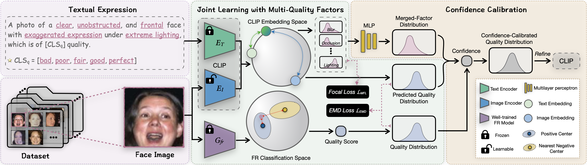

# CLIB-FIQA: Face Image Quality Assessment with Confidence Calibration

## Description
####
This is the code repository for the paper "CLIB-FIQA: Face Image Quality Assessment with Confidence Calibration," accepted in the Proceedings of the IEEE/CVF Conference on Computer Vision and Pattern Recognition (CVPR), 2024. The paper is available at [here](https://openaccess.thecvf.com/content/CVPR2024/papers/Ou_CLIB-FIQA_Face_Image_Quality_Assessment_with_Confidence_Calibration_CVPR_2024_paper.pdf).

## Abstract
####
Face Image Quality Assessment (FIQA) is pivotal for guaranteeing the accuracy of face recognition in unconstrained environments. Recent progress in deep quality-fitting-based methods that train models to align with quality anchors, has shown promise in FIQA. However, these methods heavily depend on a recognition model to yield quality anchors and indiscriminately treat the confidence of inaccurate anchors as equivalent to that of accurate ones during the FIQA model training, leading to a fitting bottleneck issue. This paper seeks a solution by putting forward the Confidence-Calibrated Face Image Quality Assessment (CLIB-FIQA) approach, underpinned by the synergistic interplay between the quality anchors and objective quality factors such as blur, pose, expression, occlusion, and illumination. Specifically, we devise a joint learning framework built upon the vision-language alignment model, which leverages the joint distribution with multiple quality factors to facilitate the quality fitting of the FIQA model. Furthermore, to alleviate the issue of the model placing excessive trust in inaccurate quality anchors, we propose a confidence calibration method to correct the quality distribution by exploiting to the fullest extent of these objective quality factors characterized as the merged-factor distribution during training. Experimental results on eight datasets reveal the superior performance of the proposed method. 


## Environment
####
The code is built on the PyTorch framework. Specifically, it requires PyTorch version 1.7.1 or later, along with the torchvision library. Additionally, you need the CUDA-enabled GPU machine to run the code effectively. Make sure to install the following dependencies:

```bash
$ conda install --yes -c pytorch pytorch=1.7.1 torchvision cudatoolkit=11.0
$ pip install ftfy regex tqdm dlib opencv-python
```

## Training
####
- **Obtaining Quality Anchors and Quality-Factor Labels**: Modify the data_path and outfile_path in the ./generate_labels.py. The dlib_weight and mfn_weight parameters are used to extract face quality factors. These pre-trained weights can be downloaded from the respective sources: [dlib_weight](https://github.com/tzutalin/dlib-android/blob/master/data/shape_predictor_68_face_landmarks.dat) and [mfn_weight](https://drive.google.com/drive/folders/18Su86Hw2pO5LBDD2eqzHJT82qTlV2gI7?usp=drive_link). For the fr_weight and header_weight parameters, you need to train a new CR-FIQA model to get the corresponding backbone and header. Please refer to the official repository [here](https://github.com/fdbtrs/CR-FIQA/tree/main) for details on the training implementation.
  > python generate_labels.py

- **Training CLIB-FIQA Model**: Download pre-trained CLIP model at [here](https://openaipublic.azureedge.net/clip/models/afeb0e10f9e5a86da6080e35cf09123aca3b358a0c3e3b6c78a7b63bc04b6762/RN50.pt) and put it into ./weights/RN50.pt path. Modify the data_list obtained by generate_labels.py in config_train.py.
  > python train.py


## Inference
####
- Download [RN50.pt](https://openaipublic.azureedge.net/clip/models/afeb0e10f9e5a86da6080e35cf09123aca3b358a0c3e3b6c78a7b63bc04b6762/RN50.pt) and put it into ./weights/RN50.pt path.
- Download our well-trained CLIB-FIQA model at [Google Disk](https://drive.google.com/file/d/18-Bkno_CWDaT9EA-FbnJ1oDcg1RDkPTt/view?usp=sharing) and put it into ./weights/CLIB-FIQA_R50.pth.
- Check the clip_model, clip_weights, and image_path parameters in the inference.py.
  > python inference.py

## Citing this Repository
####
If you find this code useful in your research, please consider citing us:
```
@InProceedings{Ou_2024_CVPR,
    author    = {Ou, Fu-Zhao and Li, Chongyi and Wang, Shiqi and Kwong, Sam},
    title     = {CLIB-FIQA: Face Image Quality Assessment with Confidence Calibration},
    booktitle = {Proceedings of the IEEE/CVF Conference on Computer Vision and Pattern Recognition (CVPR)},
    year      = {2024},
    pages     = {1694-1704}
}
```

## Acknowledgements
####
This code is primarily based on the implementation of [CLIP-Pytorch](https://github.com/openai/CLIP). It draws inspiration from [CR-FIQA](https://github.com/fdbtrs/CR-FIQA/tree/main) and [LIQE](https://github.com/zwx8981/LIQE) as well. We express our gratitude to the authors for their exceptional contributions and valuable works.
